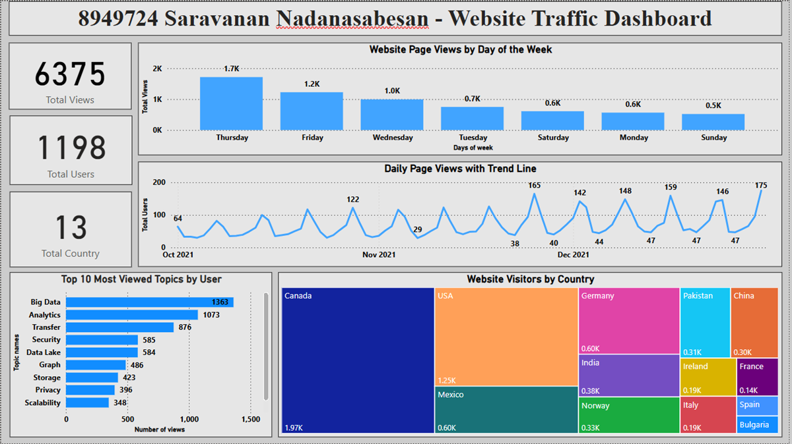

# 📊 Data Visualization and ETL Dashboard using Power BI

## 📌 Project Overview
This project was developed as part of the Applied Science and Technology program at Conestoga College between **February 2025 – April 2025**.

The objective of this project was to design and develop an interactive **Power BI dashboard solution** that enables stakeholders to monitor key business metrics, analyze operational trends, and support data-driven decision-making.

The solution focused on:
- Integrating data from multiple data sources
- Performing ETL and data transformation processes
- Building a centralized analytical data model
- Delivering interactive and dynamic dashboards for reporting

---

# 🎯 Project Goal

The primary goal of the project was to improve reporting efficiency and business visibility by automating manual reporting processes and delivering a centralized analytics dashboard.

The dashboard provides:
- KPI tracking
- Sales trend analysis
- Regional performance monitoring
- Category-level insights
- Interactive reporting capabilities

---

# 🚩 Business Challenge

The organization faced several reporting and data-related challenges:

- Data was distributed across multiple sources with inconsistent formats
- Manual reporting processes caused delays in analysis
- Stakeholders lacked real-time visibility into operational performance
- Reporting inconsistencies affected business decisions
- Existing reports lacked interactive filtering and drill-down capabilities

This project aimed to solve these issues by implementing a scalable Power BI reporting solution with automated ETL workflows and standardized reporting logic.

---

# 👨‍💻 My Role

### **Data Analyst – Dashboard Development & Insight Generation**

### Responsibilities
- Performed data extraction, transformation, and cleansing
- Built reusable ETL workflows using Power Query
- Designed and implemented a star schema data model
- Developed DAX measures and calculated columns
- Created interactive dashboards and KPI visualizations
- Automated dataset refresh processes
- Documented KPI definitions, business rules, and reporting assumptions

---

# 🏗️ Solution Architecture

## 🔹 Data Sources
- Excel Files
- SQL Server Database

## 🔹 ETL & Data Transformation
Data transformation and cleansing were performed using:
- Power Query (M Language)
- Data Profiling
- Data Validation
- Data Standardization Techniques

## 🔹 Data Modeling
Implemented a **Star Schema** model consisting of:
- Fact Tables
- Dimension Tables
- Optimized Relationships
- KPI-driven reporting structures

## 🔹 Dashboard Features
- Interactive Slicers
- Drill-through Filters
- KPI Cards
- Trend Analysis Visuals
- Regional Performance Reports
- Category-based Analysis
- Dynamic Filtering & Navigation

---

# 📊 Key Features

## ✅ ETL & Data Processing
- Consolidated datasets from multiple sources
- Applied transformation and cleansing techniques
- Standardized inconsistent data formats
- Validated data accuracy and consistency

## ✅ Data Modeling
- Designed optimized star schema architecture
- Created reusable calculated columns and measures
- Implemented relationship management for reporting efficiency

## ✅ Dashboard Development
- Built interactive dashboards using Power BI
- Developed drill-through and filtering capabilities
- Applied visualization best practices and visual hierarchy principles
- Implemented structured layouts and color-coded KPIs

## ✅ KPI & Business Insights
Generated insights for:
- Sales Performance
- Regional Analysis
- Category Trends
- Operational Reporting
- Business Growth Metrics

## ✅ Automation & Governance
- Configured automated data refresh workflows
- Documented KPI definitions and reporting logic
- Maintained reporting consistency and governance alignment

---

# 🛠️ Technologies Used

| Technology | Purpose |
|------------|---------|
| Power BI | Dashboard Development & Reporting |
| Power Query (M Language) | ETL & Data Transformation |
| DAX | KPI Calculations & Measures |
| SQL Server | Data Storage & Querying |
| Excel | Source Data Integration |

---

# 📈 Dashboard Capabilities

The dashboard enables stakeholders to:

- Monitor business KPIs in near real-time
- Analyze sales and operational trends
- Compare regional and category performance
- Perform interactive drill-down analysis
- Access centralized and standardized reports

---

# 📂 Project Deliverables

- Power BI Dashboard (`.pbix`)
- ETL Transformation Workflows
- Data Model Documentation
- KPI Definitions & Business Rules
- Reporting & Visualization Documentation

---

# 📚 Key Learnings

Through this project, I gained practical experience in:

- End-to-end ETL workflows
- Data cleansing and transformation
- Star schema data modeling
- DAX calculations and KPI development
- Interactive dashboard design
- Business intelligence reporting
- Data storytelling and visualization best practices

---

# 🚀 Future Enhancements

Potential future improvements include:

- Cloud-based data integration
- Real-time streaming dashboards
- Role-based security implementation
- Predictive analytics and forecasting
- Power BI Service deployment with scheduled refresh

---

# 📸 Dashboard Preview

> Add dashboard screenshots here

Example:
```md

```

---

# 📬 Contact

### Saravanan Nadanasabesan
**Data Analyst | Power BI | ETL | SQL | Data Visualization**

- LinkedIn: www.linkedin.com/in/saravanan-nadanasabesan-987129107
- Email: saravanasabesan@gmail.com
- GitHub: [Add your GitHub profile](https://github.com/SaravananNadanasabesan)

---